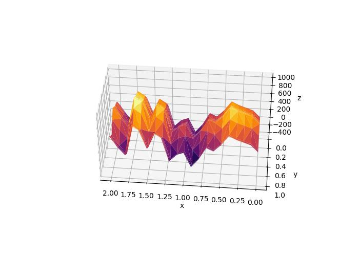
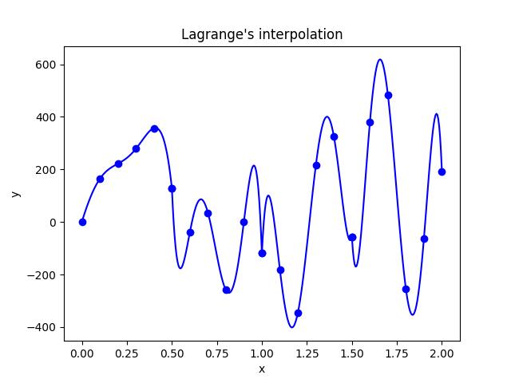
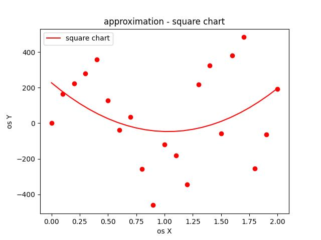
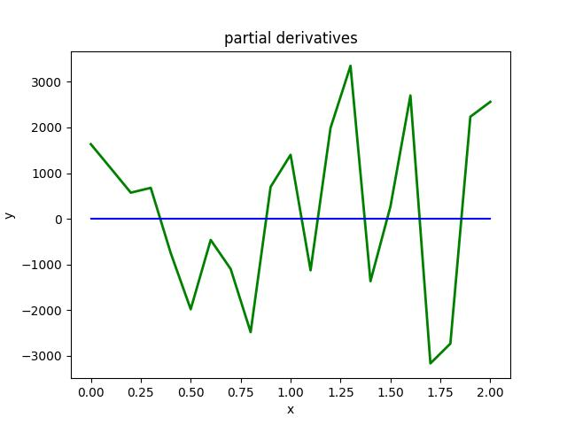

# Numerical Projects
Project for visualization and calculations on three-dimensional data

## Table of Contents
* [General info](#general-info)
* [Technologies Used](#technologies-used)
* [Setup](#setup)
* [Screenshots](#screenshots)
* [How to run app](#how-to-run-app)
* [Project Status](#project-status)

## General info
I created a tool for visualizing text data in 2D/3D, allowing you to draw graphs, create approximations, calculate integrals, and calculate the area of a spatial figure.

## Technologies Used
Project is created with:
* Python version: 3.10
* Numpy version: 2.2.3
* Matplotlib version: 3.10.1
* Scipy version: 1.15.2
* PyCharm Community Edition

## Setup
To run this project, create new empty project in PyCharm editor, copy all files and put command below in PyCharm terminal:
```
pip install -r .\requirements.txt
```

## Screenshots
### Sample screenshots from projects:
##### 3D plot

##### Lagrange interpolation

##### Quadratic approximation

##### Partial derivatives


## How to run app
Run app and choose one number between 1 and 9 from app console menu

## Project Status
Project is complete. I currently have no plans to further develop the game, as I have achieved the intended learning outcomes
